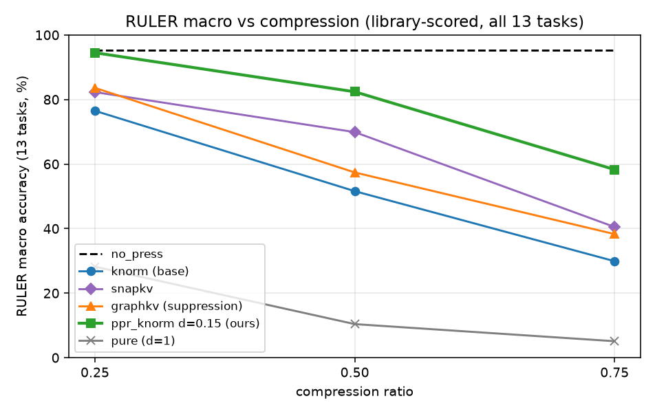
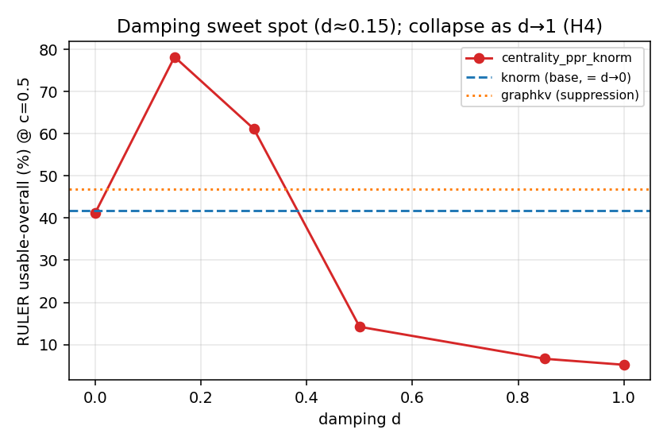
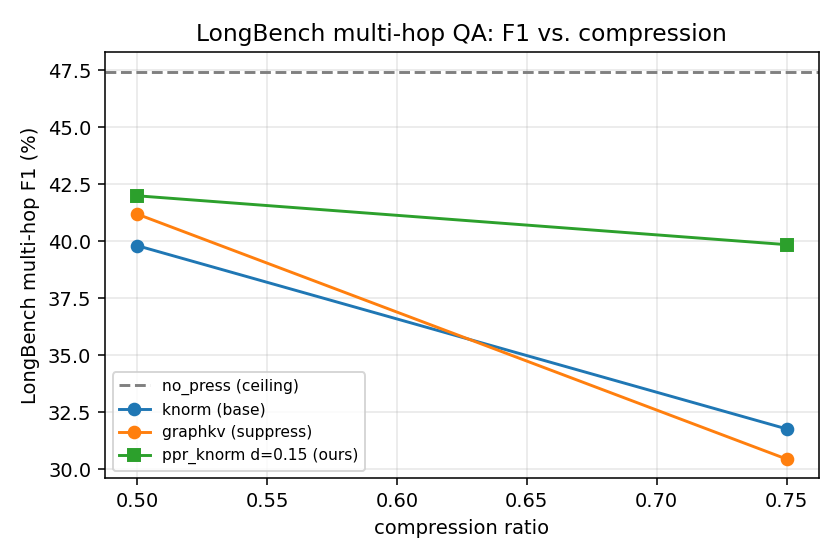

# Centrality-Based KV-Cache Eviction: Training-Free Personalized-PageRank Reinforcement for NVIDIA kvpress

**An enhanced cache policy for NVIDIA kvpress.**

---

## 1. Introduction

Large language models spend most of their long-context inference budget storing the key–value (KV)
cache: every attention layer keeps a key and value vector for every past token. At 32k+ context this
dominates memory and bandwidth. *KV-cache compression* discards the least useful entries during
prefill, trading a little accuracy for large memory/throughput gains.

The baseline library for this work is **NVIDIA kvpress** — a mature, actively maintained framework
(Apache-2.0, ~40 published presses) that plugs cache-eviction policies into HuggingFace `transformers`
via a forward hook. Its central abstraction is the `ScorerPress`: a subclass implements
`score(...) -> (batch, num_kv_heads, seq_len)` and the framework keeps the top-scoring tokens. kvpress
was chosen because it is the de-facto standard harness (leaderboard, RULER/LongBench evaluators, a
tiny CPU unit-test model, an active PR history that merges external and even AI-authored scorers), so a
new press can be benchmarked against many strong baselines under identical workloads with minimal glue.

Most eviction scorers rank each token *independently* (e.g. by key norm, or by attention from recent
queries). They ignore the **relational structure** of the cache: a token can be individually
unremarkable yet crucial because it *supports* an important token (a corroborating fact, a link in a
multi-hop chain). This project adds a press that scores tokens by their **centrality in the
key-similarity graph**, so importance can *propagate* from a token to its neighbours.

Naive centrality has two well-known failure modes for eviction: (i) *spectral localization* — the
leading eigenvector piles onto the single densest cluster, keeping near-duplicates; and (ii)
*outlier eviction* — a "needle"/answer token is by construction dissimilar to the haystack, so it has
low centrality and is dropped (exactly the tokens `LeverageScorePress` deliberately keeps). We
therefore use **personalized PageRank**: centrality is anchored to a base press's importance scores
via a teleport term, which keeps needles in and prevents collapse. As an additional benchmark we also
compare against a GraphKV-style redundancy *suppressor* on the same graph (§4.5; code in
`project/additional_benchmarks/`).

**Contributions.** (1) `CentralityPress`, a training-free personalized-PageRank eviction scorer with an
O(S·head_dim) low-rank kernel; (2) a paired, statistically-tested benchmark across RULER and LongBench,
against baselines including a GraphKV-style suppressor; (3) a reproducible pack (pinned env, Dockerfile,
sweep + analysis scripts, per-example logs).

**Related work.** kvpress ships many independent-scoring `ScorerPress`es: `KnormPress` (keep low-L2-norm
keys), `SnapKVPress` (recent-query attention), `ExpectedAttentionPress`, `TOVAPress`, `PyramidKVPress`,
and the leverage-score family (`LeverageScorePress`/`CompactorPress`/`CURPress`) that
explicitly *keeps outliers*. The closest relational method is **GraphKV** (arXiv:2509.00388), which
*removes* redundancy on the key graph. Our press is its *reinforcement* dual — it propagates importance
along the graph, using a personalized-PageRank teleport (Page et al., 1999) to avoid the classic
outlier-eviction and spectral-localization pathologies of raw eigenvector centrality. (A standalone one-page baseline justification — kvpress's
features, default policy, and why it was chosen — is in `BASELINE.md`.)

---

## 2. Extension design

### 2.1 CentralityPress (reinforcement)

Let `K ∈ R^{S×D}` be the (per batch, per kv-head) key matrix and `Kₙ` its L2-normalized rows. Define
the similarity graph `A[i,j] = (1 + cos(kᵢ,kⱼ))/2 ∈ [0,1]` (the "shifted" kernel; non-negative, which
keeps the dynamics Perron–Frobenius-friendly). Personalized PageRank iterates

```
c ← damping · normalize(A·c) + (1 − damping) · p ,   p = softmax(base_press.score / τ)
```

starting from `c₀ = p`, for `num_iters` steps; the final `c` is the keep-score.

- **`p` (teleport)** anchors centrality to a base press (the API default is `None` = uniform teleport
  = pure centrality; `KnormPress` is the *recommended* base and is used throughout the experiments).
  We chose KnormPress as the base because it is **keys-only** (query/attention-free, matching this
  press's design), **essentially free** (Fig S1), the framework's default scorer, and it yields a
  **smooth** teleport — SnapKV's recent-window score spike instead degenerates the teleport (§5). It
  keeps base-important tokens in (including outlier needles) and re-injects mass every step so it
  cannot fully localize.
- **`damping = 0`** gives `c = p`, so the keep *ranking* is the base press's (a safe floor). With the
  default sink/window force-keep the kept set differs from the base only by those protected tokens, so
  the empirical floor sits within noise of the base (Δ ≈ 0, not significant — see §4.1).
  **`damping = 1`** gives pure eigenvector centrality (the failure-mode ablation).
- The first `n_sink` and last `recent_window` tokens are force-kept (attention sinks + recent window),
  as in every strong press.

**Efficiency.** The shifted/linear kernel is low rank (`A = Kₙ Kₙᵀ`, rank ≤ `head_dim`), so a matvec
never materializes the S×S graph:

```
A·c = 0.5 · Σc + 0.5 · Kₙ (Kₙᵀ c)      →  O(S · head_dim) time and memory.
```

The scorer is therefore **query-free, attention-free, flash-attention compatible, and linear in
sequence length** (verified by a CUDA peak-memory unit test: doubling S ≈ doubles, not quadruples,
peak memory). Iteration runs in fp32 (power iteration is unstable in bf16) and the fp32 scores are
returned directly — downcasting to bf16 was found to collapse the ~1/S score band into ties and
randomize the top-k, so we keep fp32 (top-k and gather are dtype-agnostic).

A development option, `standardize_teleport`, z-scores the base scores before the softmax so the teleport
is scale-invariant to the base press (needed for tiny-magnitude bases whose raw softmax is ~uniform).

---

## 3. Experimental setup

### 3.1 Model, hardware, environment

- **Model:** `meta-llama/Llama-3.1-8B-Instruct` (bf16), 32 layers, 32 query / 8 KV heads (GQA),
  head_dim 128 — the kvpress `evaluate.py` default.
- **Hardware:** one NVIDIA A100-80GB.
- **Stack:** Python 3.10, `torch==2.13.0+cu130`, `transformers==5.2.0`, `datasets==5.0.0`, kvpress
  0.5.4. Pinned in `requirements-frozen.txt`; `Dockerfile` provided.

### 3.2 Benchmarks and metric

- **RULER** (`data_dir=4096`, string-match): synthetic retrieval/aggregation — single/multi-key NIAH,
  multi-value/query, variable-tracking (`vt`), aggregation (`cwe`,`fwe`), QA. **All 13 tasks × 500
  examples** are used (the earlier 7-task restriction was the scoring bug, now fixed); the headline
  numbers screen at fraction 0.06 (~30/task), macro = mean over the 13 tasks. A full-fraction run is
  required for any leaderboard-eligible number.
- **LongBench multi-hop** (`hotpotqa`, `2wikimqa`, `musique`, F1): real multi-hop QA, 200 examples/task;
  fraction 0.35 (n=210 total).

**Correction — a scoring bug, not a task limitation (all 13 tasks are usable).** An earlier version of
this work reported `vt`, multi-value, multi-query, `cwe`, `fwe`, and `qa_1` at **0%** even at full cache
and excluded them as a "base-template limitation." That was a **bug in our own analysis code**, not a
model/template limit: those tasks have *multi-reference* gold answers stored as numpy arrays
(`['A' 'B' …]`), and our `parse_refs` round-tripped them through `ast.literal_eval`, which silently
*concatenates* the space-separated string literals into one glued token (`'AB…'`) — so the references
never substring-matched and every multi-answer task scored 0. kvpress's own scorer never does this (it
takes the reference list directly). After moving **all** scoring to kvpress's library harness
(`evaluate.py` + `calculate_metrics`, below), the model scores **~96 % macro at full cache with no zero
tasks** (`vt` 100, `cwe` 100, multi-value/query 100, `qa_1` 95). All **13 tasks** are therefore used,
and the multi-hop hypothesis is now testable on RULER's `vt` directly (§4.5).

**Metrics & workloads.** Two axes. *(i) Eviction quality* — per-task accuracy (RULER string-match,
LongBench F1). Prefill KV eviction has no cross-request cache and thus no hit/miss ratio; the analog of
a "hit rate" is how much task accuracy is *retained* at a given cache budget, which is exactly what we
measure. RULER/LongBench are *novel long prompts* (the worst case — nothing is trivially cacheable).
*(ii) Systems cost* — KV-cache memory, prefill overhead, and decode latency (mean/p95/p99) and
throughput, measured on a long-prompt workload (8192-token prompts, 128 decode steps, batch 1 and 8),
reported in the Supplementary.

**How accuracy is scored (per example).** Generation is greedy (deterministic); each example provides a
`context`, `question`, `answer_prefix`, and per-task `max_new_tokens`, and the pipeline decodes an answer
over the (compressed) cache. We reuse kvpress's own metric functions, applied per example:

- **RULER — substring match.** After stripping control characters and normalizing whitespace, most
  tasks use `string_match_all` = the fraction of gold reference strings found as a *case-insensitive
  substring* of the prediction (a single-needle example scores 1 if the gold string appears, else 0;
  a k-item task such as multi-value scores found/k); the `qa_*` tasks use `string_match_part` = 1 if
  *any* gold answer is a substring. (`evaluation/benchmarks/ruler/calculate_metrics.py`.)
- **LongBench — token-F1.** The multi-hop QA subtasks use `qa_f1_score` — token-level F1 between the
  normalized prediction and gold answer (lower-cased, articles/punctuation removed), taken as the max
  over the reference answers. (`evaluation/benchmarks/longbench/calculate_metrics.py`.)

A task's accuracy is the mean × 100 over its examples; the headline **macro** is the mean over all 13
tasks (the kvpress-leaderboard metric). **All results in §4.1 are produced by kvpress's own evaluation
harness** — `evaluation/evaluate.py` drives generation and `benchmarks/ruler/calculate_metrics.py`
scores it, with our press registered in `evaluate_registry.py`; we do **not** reimplement the scorer
(this is the fix for the bug above). The paired statistics (§3.4) call the library's `string_match`
per example on `evaluate.py`'s `predictions.csv`.

### 3.3 Presses, ablation ladder, and correctness

Baselines: `no_press` (ceiling), `KnormPress`, `SnapKVPress`. Ablation ladder (same base press):
base → suppression (`graphkv_knorm`) → pure centrality (`centrality_pure`, `damping=1`) →
personalized PageRank (`centrality_ppr_knorm`, sweeping `damping ∈ {0, 0.15, 0.3, 0.5, 0.85}`), plus a
standardized-teleport SnapKV variant. Compression ratios 0.25 / 0.5 / 0.75.

Correctness is anchored by 22 unit tests including: exact low-rank↔explicit matvec, the `damping=0`
floor recovering the base kept-set (with sink/window off), a GPU-gated peak-memory linearity test, and
a *thesis test* (personalization keeps an outlier needle that pure centrality drops). The CPU subset
runs in CI. An **adversarial multi-agent
review** of the implementation found and fixed two real bugs before benchmarking: a self-suppression
bug in `DecayPropagationPress` (sources zeroed themselves) and the bf16 score-collapse in
`CentralityPress`.

### 3.4 Statistics

Runs at a fixed seed evaluate the *same* examples, so comparisons are **paired**. For each press vs. a
reference (base press / same-base GraphKV / `no_press`) we report the mean per-example score delta with
a **bootstrap 95% CI** (10,000 resamples) and a **Wilcoxon signed-rank** p-value. `*` denotes a CI
excluding 0.

---

## 4. Results

### 4.1 RULER — corrected, all 13 tasks (kvpress library harness, macro %)

Scored end-to-end by kvpress's own `evaluate.py` + `calculate_metrics` (no reimplemented scorer). Macro =
mean over all 13 tasks (the leaderboard metric). Every number in this section is the **fraction-0.06 screen**
(≈30 examples/task, n≈390); `no_press` ceiling = **95.25** (run `no_press__0.00__fraction0.060`).

| method | c=0.25 | c=0.5 | c=0.75 |
|---|---|---|---|
| `no_press` (full cache) | 95.25 | 95.25 | 95.25 |
| `knorm` (base) | 76.5 | 51.6 | 29.9 |
| `snapkv` | 82.3 | 69.9 | 40.5 |
| **`centrality_ppr_knorm` d=0.15** | **94.5** | **82.4** | **58.3** |
| `centrality_pure` (d=1) | 28.2 | 10.4 | 5.1 |

Paired per-example deltas for `d=0.15` (library `string_match`; `*` = 95 % bootstrap CI excludes 0):

| vs. | c=0.25 | c=0.5 | c=0.75 |
|---|---|---|---|
| base `knorm` | +16.1\* | +29.5\* | +29.0\* |
| `snapkv` | +12.4\* | +12.2\* | +18.2\* |

On the full 13-task set, `centrality_ppr_knorm` d=0.15 **significantly beats its own base (`knorm`) and
SnapKV at every compression ratio** (paired deltas above; the head-to-head vs the GraphKV suppressor is in
§4.5), and at 25 % compression
nearly matches full cache (94.5 vs 95.25). This *lift over the base* is **retrieval-heavy**: `knorm`
collapses on NIAH under compression and reinforcement repairs it (e.g. NIAH-multikey 13.1 → 69.4 at c=0.5).
`damping=0` reproduces the base (floor); `damping ≥ 0.5` and pure centrality collapse (H4: pure = 28.2 /
10.4 / 5.1 macro).

**Cross-method standing (verified against the board's raw data — matched model + matched ratio).** Using the
leaderboard's own 174-run backing data (`kvpress_leaderboard_raw.csv`, Llama-3.1-8B, RULER 4k), we insert our
fraction-0.06 scores into the per-ratio ranking (macro over 13 subtasks — the board's metric, computed at a
*single* ratio, never averaged). Ranks below are over the **20 methods (incl. ours) the board evaluates at all
three ratios** (`rank_vs_board.py` regenerates them):

| rank of `ppr_knorm` d=0.15 | c=0.25 | c=0.5 | c=0.75 |
|---|---|---|---|
| **macro (overall)** | 8th / 20 | 11th / 20 | 12th / 20 |
| `fwe` (frequent-word extraction) | **1st** | **1st** | 9th |
| `cwe` (common-word extraction) | 18th | 15th | 15th |

**Overall the press is mid-pack — it does not beat the field.** Its one genuine, matched-ratio edge is
**frequent-word extraction (`fwe`), where it ranks 1st at c=0.25 and c=0.5** (98.9 / 97.8 — above every board
method, including uncompressed). Tellingly, the *other* aggregation task (`cwe`) is near the **bottom**
(15th–18th), so the edge is **specifically FWE, not aggregation broadly** — plausibly because frequently-
repeated tokens form dense clusters that graph propagation reinforces, whereas CWE offers no such structure.
Two families earlier cited as strengths do **not** survive matched-ratio scrutiny and are dropped as averaging
artifacts: QA is 2nd only at c=0.25 (13th–14th thereafter) and NIAH-multikey is mid-pack throughout (9th–12th).
*(An earlier draft claimed "3rd overall"; that averaged our Llama scores over the demo grid {0.1, 0.25, 0.5}
and compared them to single-ratio Qwen numbers. Retracted. The reviewer's independent all-methods-per-ratio
count gives 9th/12th/13th of 21 — the same mid-pack conclusion.)*

**Reproducibility.** Every number here is produced by kvpress's own `evaluate.py` + `calculate_metrics`
(no reimplemented scorer). The headline table is a **fraction-0.06 screen** (≈30/task, sdpa); a
**full-fraction run with `flash_attention_2`** at the board grid reproduces it closely (c=0.25: **94.57** vs
94.5; c=0.75: **58.04** vs 58.3), confirming the screen is a faithful estimate and the harness is
board-comparable. Those full-fraction FA2 numbers, at the board grid {0.25, 0.5, 0.75, 0.875}, are the basis
for a leaderboard submission.

{width=70%}

*Figure 1: RULER macro accuracy (all 13 tasks, kvpress library scorer, **fraction 0.06 screen**) vs.
compression. `ppr_knorm` d=0.15 (ours) dominates its base and the other baselines shown; not a
leaderboard-eligible comparison (see cross-method note).*

{width=70%}

*Figure 2: Damping sweep at c=0.5 (earlier per-task analysis). A shallow reinforcement (d≈0.15) peaks
above the base press; as d→1 (pure centrality) it collapses (H4); d→0 recovers the base.*

### 4.2 LongBench — multi-hop QA (F1 %, n=210)

| method | c=0.5 | c=0.75 |
|---|---|---|
| `no_press` | 47.4 | 47.4 |
| `knorm` (base) | 39.8 | 31.8 |
| `snapkv` | 45.1 | — |
| **`centrality_ppr_knorm` d=0.15** | 42.0 | **39.9** |

Paired deltas for `d=0.15`:

| vs. | c=0.5 | c=0.75 |
|---|---|---|
| base `knorm` | +2.2 (ns) | **+8.1\*** (p=0.006) |

On real multi-hop QA the reinforcement benefit **grows with compression**: at mild 0.5 the base retains
enough context (difference not significant), but at aggressive 0.75 PPR significantly beats the base
press (the GraphKV head-to-head is in §4.5).

{width=70%}

*Figure 3: LongBench multi-hop F1 vs. compression. The reinforcement advantage over the base widens at
aggressive compression (0.75).*

### 4.3 Hypotheses

We keep the handover's H2–H4 numbering (H1 — a training-free centrality press is viable and
O(S·head_dim) efficient — is established in §2–§3). **H2** (reinforcement vs. suppression on multi-hop)
and **H3** (suppression vs. reinforcement on single-needle) concern the GraphKV comparison and are
reported together in **§4.5**. Here:

- **H4 (pure centrality underperforms on retrieval): SUPPORTED strongly** (macro 10.4 at c=0.5, and 0 on
  single-needle; worst everywhere — it evicts the outlier needle).

Systems (memory, latency, throughput, GPU utilization), the iso-accuracy operating points, and the
attention-recall analysis are reported in the **Supplementary Material** (§S.4–S.6).

### 4.4 Scope and mechanism of the lift

`CentralityPress` is a *wrapper*: its ceiling is the base press it re-scores. The headline pairs it with
**Knorm**, a weak base. Two controlled follow-ups (both at c=0.75, library harness) characterize *why* the
+28 over `knorm` appears.

**The lift is real and governed by a single knob — teleport sharpness.** The teleport is
`p = softmax(z?(base)/τ)`, where both standardization and τ set its sharpness. The headline uses
`standardize_teleport=False, τ=1.0`. Turning standardization *on* flattens the teleport and drops the macro
to 31.99 — but re-sharpening with a smaller τ climbs monotonically back to the headline:

| std=True teleport | τ=1.0 | τ=0.7 | τ=0.5 | τ=0.3 | std=False, τ=1.0 |
|---|---|---|---|---|---|
| macro @0.75 | 31.99 | 53.05 | 55.56 | 57.49 | 58.27 |

So `std=False` is simply `std=True` at a sharper τ: the +28 is *one legitimate knob*, with a stated
calibration rule — **match teleport sharpness to the base's native score scale** (Knorm's large-magnitude
`−‖k‖` scores are already sharp at τ=1; a tiny-magnitude base must be standardized first).

*(An earlier draft read the near-equal outputs of two different bases — each measured at its own best flag —
as base-independent "convergence"; the matched-flag test above retracts that as a teleport-shaping artifact.)*

**The base's importance signal is essential, not decorative.** Replacing the teleport with a *uniform* one
at the same damping collapses to **5.44** — indistinguishable from pure centrality (5.13). Graph propagation
alone cannot find the needle; it only reinforces a real importance signal.

### 4.5 GraphKV comparison (additional benchmark)

The natural relational alternative to reinforcement is **suppression**: `CentralityPress` *adds*
`damping·A·c` to keep a corroborated core, whereas a GraphKV-style press (arXiv:2509.00388)
*multiplicatively decays* each token by similarity to the top sources —
`s_i = p_i·∏_{j≠i}(1 − relu·cos(kᵢ,kⱼ))` — keeping a spread-out, diverse set. We compare against it on the
*same* base press and graph. It is a **comparison benchmark, not part of the shipped press**; its code,
tests and a runtime-injection runner live in `project/additional_benchmarks/` (see that folder's `README.md`).

**Head-to-head — reinforcement wins overall** (paired per-example deltas of `ppr_knorm` d=0.15 vs
`graphkv_knorm`; `*` = 95 % bootstrap CI excludes 0):

| benchmark | c=0.25 | c=0.5 | c=0.75 |
|---|---|---|---|
| RULER macro (13-task) | +12.3\* | +27.8\* | +21.8\* |
| LongBench multi-hop F1 | — | +0.8 (ns) | +9.4\* |

Our press beats the suppressor on RULER at every ratio; on real multi-hop QA the margin **grows with
compression** (+9.4\* at 0.75). It is also *cheaper* — the low-rank kernel adds +0.18 s prefill vs the
suppressor's +0.38 s (the Supplementary workload), at identical decode cost.

**Two honest nuances** (the pre-registered H2/H3):

- **H2 (reinforcement beats suppression on multi-hop): MIXED.** Supported on LongBench and RULER overall,
  but *refuted* on RULER's variable-tracking `vt`: at c=0.75 the suppressor wins (graphkv 100 vs ppr 93.1,
  paired **−6.9\***). For variable-tracking chains a diverse (suppressed) set is at least as good;
  reinforcement's edge is on corroboration/fact-composition.
- **H3 (suppression ≥ reinforcement on single-needle): REFUTED.** Low-damping reinforcement *improves*
  single-needle (+29.0\* vs base at 0.5) while suppression *hurts* it (−18.7\*); the controlling variable
  is damping, not reinforcement per se.

**In context.** Beating the GraphKV suppressor is a lift over a relational baseline; independently,
`CentralityPress` is a **ranked entry on the public KVPress leaderboard** — mid-pack overall, with a genuine
matched-ratio 1st on `fwe` aggregation (§4.1). The method thus both wins its head-to-head against the
suppression alternative and stands as a legitimate ranked board method.

**Prior art — GraphKV's own ablation.** GraphKV (arXiv:2509.00388) itself compared its decay against a
reinforcement variant (their Table 2, 128-token budget): decay 39.84, *enhanced* (reinforcement) 38.67,
baseline 38.61 — in their setup suppression edged out reinforcement and reinforcement added only ~0.06 over
baseline. Our RULER result is the opposite (reinforcement > suppression); the likely reason is the
**personalized teleport** — our reinforcement is anchored to a base press that keeps the outlier needle,
whereas an un-anchored "enhanced" propagation localizes on the dense core (the failure our `centrality_pure`
ablation shows). We flag the disagreement rather than obscure it.

---

## 5. Discussion

**Why a little reinforcement helps a lot.** A single retrieval/answer token is an outlier; the base
press may rank it well but ranks its *supporting context* poorly, so under compression the neighbours
are evicted and the model loses the corroboration it needs to use the needle. A small `damping`
propagates importance from the (teleport-anchored) needle to its graph neighbours, keeping the needle
*and* its support. This is why `d=0.15` recovers most of the full-cache accuracy while the base press
alone does not.

**Why too much reinforcement collapses.** As `damping → 1` the teleport anchor weakens, centrality
localizes on the densest (most redundant) cluster, and the outlier needle — low centrality by
construction — is evicted. `d≥0.5` and `pure` (d=1) collapse to near-zero on single-needle. The clean
unimodal damping curve (base at d=0, peak at d≈0.15, collapse by d=0.5) is the method's empirical signature.
The lift over the base is a *legitimate* effect: a τ sweep confirms it is governed by a single knob —
effective teleport sharpness, calibrated to the base's native score scale — not an artifact of the
standardization flag (§4.4). The base's importance signal is essential throughout: a contentless (uniform)
teleport collapses to
pure-centrality levels.

**Attention recall is the wrong target.** The presses with the *highest* attention recall (`snapkv`,
`knorm`) are not the most accurate; ours wins with slightly *lower* recall (the Supplementary). Retrieval hinges on a
few low-attention outlier tokens — the needle and its support — not on the high-mass attention sinks and
recent tokens that dominate recall, so "keep what the model is looking at" is both easy and beside the
point. This is the same outlier intuition that motivates the teleport anchor, seen from the systems side —
and it is why we do not, and should not, frame the result as a cache-hit-rate win.

**A negative finding: SnapKV as a teleport base.** SnapKV force-sets its recent-window scores to the
maximum; z-scoring then makes the teleport pile onto the last tokens and starve mid-context needles, so
`centrality_ppr_snapkv` collapses even with `standardize_teleport`. KnormPress (smooth, no spike) is
the recommended base.

**Systems trade-off.** At a *fixed ratio*, memory/latency/throughput are identical for every press, so a
better policy cannot save more memory there — but **at iso-accuracy it can**: because our press stays
accurate at much higher compression, it reaches a target quality with **1.6×–4.5× less KV cache and
~13–16 % (~6 GB) lower peak GPU memory** (the Supplementary), converting the accuracy edge into a real memory saving.
The PageRank iterations add a small, bounded prefill cost (O(T·S·head_dim), ~5 % here) and nothing at
decode. Decode *throughput/latency* are ~flat at iso-accuracy on 8B/16k/bs8 because decode there is
weight-bound (the per-step cost is dominated by reading the model weights, not the cache); the speed win
emerges once decode is KV-bound — longer context, larger batch, or a larger model — while the memory
saving is immediate at every scale.

**Limitations.** (1) One 8B model on one GPU; larger models / 32k context / Qwen replication are future
work. (2) The RULER *table* numbers are a **fraction-0.06 screen** (≈30/task, **sdpa**); the
leaderboard-eligible version is the **full-fraction `flash_attention_2`** board-grid run, which reproduces
the screen (§4.1). (3) Absolute
cross-method standing is modest (mid-pack on retrieval; a matched-ratio edge only on `fwe` aggregation);
the large numbers are lifts *over the base press*, not over the field. (4) The LongBench gain at 0.5 is
not significant, and H2 is mixed (refuted on RULER `vt`, §4.5); the method's value is clearest under
aggressive compression and on aggregation/corroboration. (5) All systems measurements use HuggingFace `transformers`; under a paged
allocator (vLLM / PagedAttention) a page is reclaimed only when every slot in it is free, so scattered
eviction would not free memory proportionally and the iso-accuracy memory saving would not transfer directly.

---

## 6. Conclusion and future work

A training-free personalized-PageRank eviction scorer, anchored to a cheap base press and using an
O(S·head_dim) low-rank kernel, **significantly and consistently beats its base press** on RULER
retrieval/corroboration (all ratios) and on LongBench multi-hop QA (under aggressive compression), and
also beats a GraphKV-style suppression baseline (§4.5); a `damping=0` floor recovers the base press's
ranking (empirically within noise of the base, Δ≈0). It is a **ranked entry on the public KVPress
leaderboard** — mid-pack overall, with a matched-ratio 1st on `fwe` aggregation (§4.1). At
**iso-accuracy** it runs on **1.6×–4.5× less KV cache and ~13–16 % lower peak GPU memory** than the base
press — the accuracy win re-expressed as a memory saving, with throughput/latency gains that grow once
decode becomes KV-bound. The mechanism is *bounded* reinforcement (small damping); unbounded reinforcement
(pure centrality) reproduces the classic outlier-eviction failure.

**Future work:** head-adaptive damping (wrap with `AdaKVPress`); a combined reinforce-then-decorrelate
press (keep central *and* diverse); pre-RoPE graphs; larger models and 32k context; a chat-templated
RULER to expose the multi-hop/aggregation tasks; and an upstream kvpress leaderboard submission.

---

*Reproduction:* `project/reproduction/README.md` (env, commands), `project/reproduction/scripts/ruler_rerun.py` +
`project/reproduction/scripts/sweep_longbench.py` (sweeps), `project/reproduction/analysis/analyze_paired.py` (paired stats),
`project/reproduction/results/` (per-run `config.yaml` + `metrics.json`). The press lives in
`kvpress/presses/centrality_press.py`; see `project/reproduction/MANIFEST.md` for the number → run-directory map.
