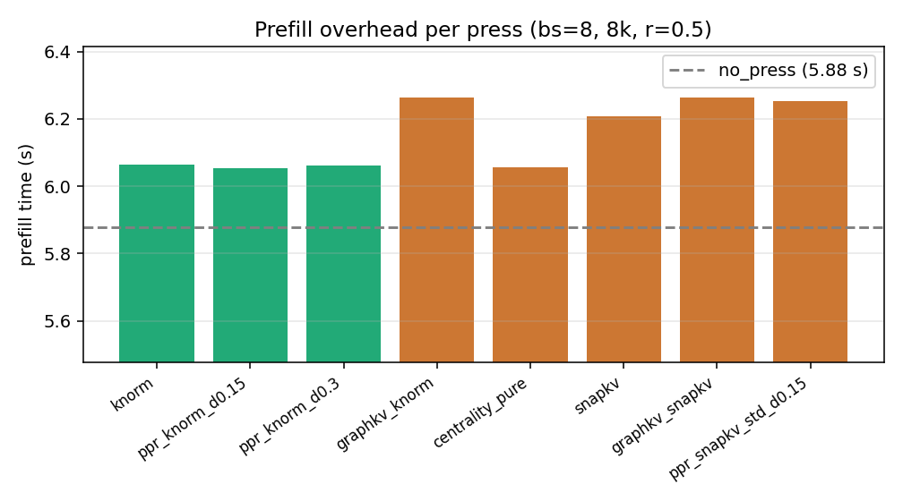
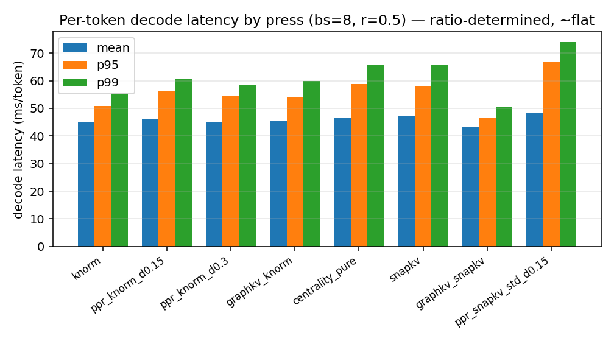
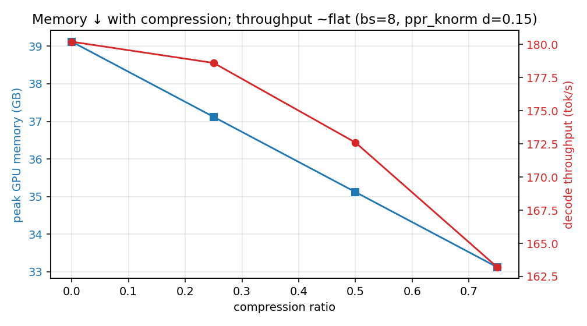
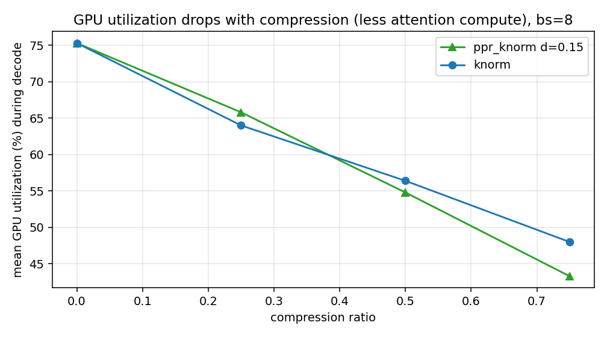
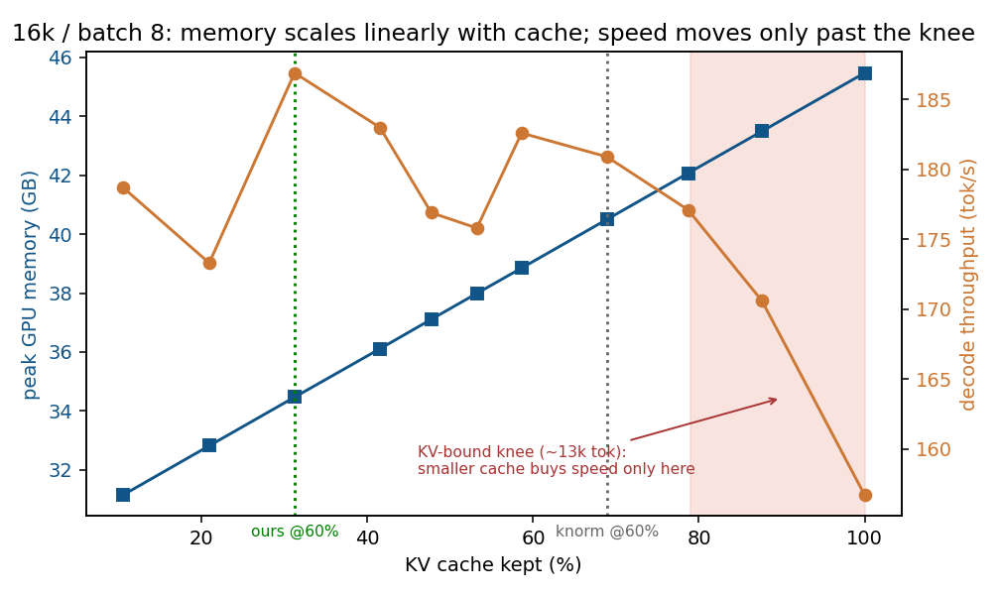
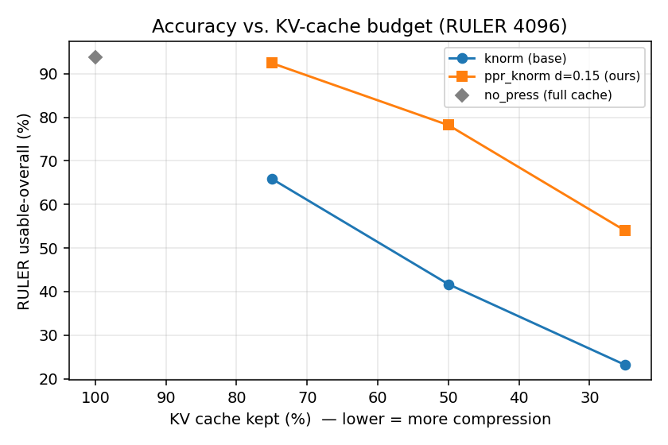
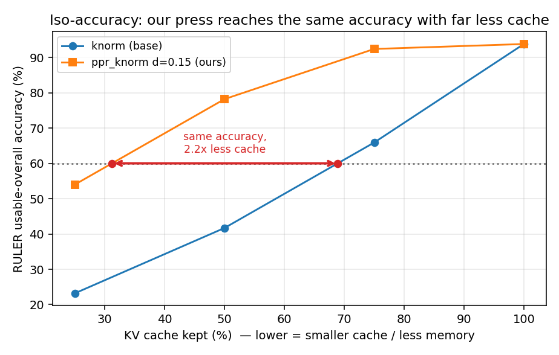
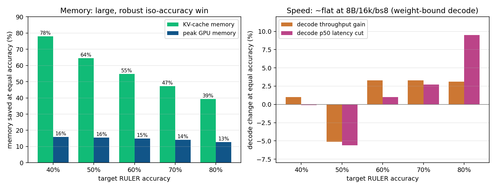

# Supplementary Material — Centrality-Based KV-Cache Eviction

Companion to the main report (`REPORT.pdf`): detailed per-press systems figures and per-task result
tables. See the report §4.4–4.5 for the summary and interpretation.

## S.1 Per-press systems figures

*Figure S1: Prefill scoring overhead — the only press-dependent systems cost; `ppr_knorm` ≈ `knorm`,
cheaper than `graphkv` / SnapKV-based presses.*

*Figure S2: Per-token decode latency (mean/p95/p99) by press at r=0.5 — ratio-determined, ~flat.*

*Figure S3: Peak GPU memory falls linearly with compression; decode throughput ~flat at this scale.*

*Figure S4: Mean decode GPU utilization drops with compression (less attention compute per token).*

## S.2 Per-task tables

### RULER 4096 @ compression 0.5 (string-match %, usable tasks)

| task | no_press | knorm | graphkv | snapkv | ppr d=0.15 | pure |
|---|---|---|---|---|---|---|
| niah_single_1 | 100 | 100 | 100 | 94.7 | 100 | 0 |
| niah_single_2 | 100 | 80.0 | 20.0 | 97.1 | 100 | 0 |
| niah_single_3 | 100 | 2.9 | 5.9 | 0 | 73.5 | 0 |
| niah_multikey_1 | 100 | 30.0 | 40.0 | 90.0 | 90.0 | 6.7 |
| niah_multikey_2 | 100 | 4.8 | 81.0 | 61.9 | 100 | 0 |
| niah_multikey_3 | 100 | 4.5 | 36.4 | 22.7 | 18.2 | 0 |
| qa_2 | 58.1 | 32.3 | 48.4 | 48.4 | 48.4 | 29.0 |

### LongBench multi-hop @ compression 0.5 (F1 %)

| subtask | no_press | knorm | graphkv | snapkv | ppr d=0.15 |
|---|---|---|---|---|---|
| hotpotqa | 58.5 | 54.1 | 45.9 | 56.7 | 49.2 |
| 2wikimqa | 53.1 | 45.9 | 46.7 | 53.5 | 53.4 |
| musique | 30.7 | 19.5 | 30.9 | 25.2 | 23.4 |

Per-run configs + metrics are under `project/reproduction/results/` (`config.yaml` + `metrics.json` each; the aggregated
per-example `*_long.csv` are report-only — regenerable, see `project/reproduction/MANIFEST.md`). Regenerate figures with
`analysis/make_figures.py` and paired stats with `analysis/analyze_paired.py`.

## S.3 Iso-accuracy operating-point curve (16k, batch 8)

*Figure S5: Directly measured peak GPU memory and decode throughput vs. kept-cache fraction (16k prompt,
batch 8, `analysis/iso_systems.py` on `results/results_iso_systems_16k_bs8.csv`). Peak memory falls
linearly with the cache; throughput is essentially flat once the cache is compressed (decode is
weight-bound at 8B/16k/bs8). The dotted lines mark the iso-accuracy operating points for a 60 % RULER
target: the base press must keep ~69 % of the cache, ours only ~31 % — same accuracy, 2.2× less cache and
~6 GB less peak memory, while throughput is unchanged (the speed win needs a more KV-bound regime).*

## S.4 Systems: memory, latency, throughput, GPU utilization

We measured the systems metrics across **all** presses (mirroring the accuracy sweep) on a long-prompt
workload: 8192-token prompt, 128 decode steps, **batch 8**, Llama-3.1-8B bf16, A100-80GB. The central
fact: **at a fixed compression ratio the kept-cache length is identical for every press**, so decode
memory, latency, throughput and GPU utilization are *ratio-determined* — the same for `knorm`, `snapkv`,
`centrality_pure` and our press. The **only press-dependent systems cost is prefill overhead**.

Full comparison at ratio 0.5 (batch 8):

| press | prefill (s) | peak GPU (GB) | KV cache (MB) | tok/s | latency mean/p95/p99 (ms) | GPU util |
|---|---|---|---|---|---|---|
| `no_press` (r=0) | 5.88 | 39.1 | 8192 | 180 | 44.4 / 48.6 / 54.6 | 75 % |
| `knorm` | 6.07 | 35.1 | 4096 | 178 | 44.9 / 50.8 / 55.5 | 56 % |
| `snapkv` | 6.21 | 35.1 | 4096 | 169 | 47.2 / 58.2 / 65.6 | 54 % |
| `centrality_pure` | 6.06 | 35.1 | 4096 | 172 | 46.5 / 58.8 / 65.8 | 57 % |
| **`ppr_knorm` d0.15** | **6.05** | 35.1 | 4096 | 173 | 46.4 / 56.2 / 60.8 | 55 % |
| `ppr_snapkv_std` d0.15 | 6.25 | 35.1 | 4096 | 166 | 48.2 / 66.7 / 74.0 | 53 % |

Every press at r=0.5 uses the same 4096 MB / 35.1 GB and runs at ~the same latency and throughput
(Figs S2–S3) — memory and speed are functions of the *ratio*, not the policy. What differs is prefill
overhead (Fig S1): **`ppr_knorm` (+0.18 s over `no_press`) is as cheap as `knorm` (+0.19 s)** — the
low-rank kernel makes the PageRank iterations essentially free — and *cheaper* than every SnapKV-based
press (+0.33–0.39 s, attention compute); its prefill edge over the GraphKV suppressor is noted in §4.5. Across the ratio
sweep, peak memory falls **39.1 → 37.1 → 35.1 → 33.1 GB** and GPU utilization **75 → 64 → 56 → 45 %** as
compression rises 0 → 0.75 (less attention compute per token), while decode throughput stays ~flat
(~170–185 tok/s): at 8B/8k decode is weight-bound, so the latency/throughput benefit would grow at
longer context or larger batch, where the KV cache dominates decode.

*Cache hit rate* is not defined for prefill KV eviction — there is no cross-request cache, hence no
hit/miss; the meaningful analogs are **retention accuracy** (Fig 4): how much task accuracy survives at a
given cache budget, and **attention recall** (the main report): the share of the model's real attention mass that the
kept set captures — which, tellingly, our press does *not* maximise. *CPU utilization* is negligible — the
workload is GPU-bound.

Per-press systems figures — prefill overhead, decode-latency percentiles, memory/throughput and GPU
utilization vs. ratio — are in the Supplementary Material (Figs S1–S4).

Because memory is fixed by the ratio, a better policy buys **more accuracy per byte** — the
accuracy–memory Pareto front (Fig 4), where our press dominates the base press at every budget.

{width=70%}
*Figure 4: Accuracy vs. KV-cache budget on RULER (lower x = more compression) — the retention /
"hit-rate" analog. At every budget `ppr_knorm` d=0.15 sits far above the base press at the same memory.*

## S.5 Iso-accuracy: memory, throughput and latency at equal quality

The systems metrics are set by the kept-cache length (the main report) and the accuracy win is at a fixed ratio
(§4.1); the two combine into the operationally decisive question — **for the same accuracy, how much
does the smaller cache save?** We invert the RULER accuracy-vs-budget curves to the cache fraction each
press needs to hit a target accuracy, then read the **directly measured** decode metrics at those
fractions (16k-token prompt, batch 8, 128 decode steps — the KV-bound regime; see
`results/results_iso_systems_16k_bs8.csv`, `analysis/iso_systems.py`).

| target acc. | cache reduction | KV memory saved | peak GPU mem saved | decode throughput | decode p50 latency |
|---|---|---|---|---|---|
| 40 % | **4.5×** | 78 % | 16 % (6.0 GB) | +1 % | −0 % |
| 50 % | **2.8×** | 64 % | 16 % (6.0 GB) | −5 % | −6 % |
| 60 % | **2.2×** | 55 % | 15 % (6.0 GB) | +3 % | +1 % |
| 70 % | **1.9×** | 47 % | 14 % (6.0 GB) | +3 % | +3 % |
| 80 % | **1.6×** | 39 % | 13 % (5.5 GB) | +3 % | +9 % |

**The iso-accuracy win is a memory win.** At equal output quality our press needs **1.6×–4.5× less KV
cache** (39–78 % less KV memory) and **~13–16 % (~6 GB) lower peak GPU memory** than the base press —
large, monotone, and *exact* for the KV cache (linear in kept length). This is the headline: the accuracy
advantage of §4.1 *is* a memory advantage — same quality, much smaller footprint — which is exactly what
lets a fixed GPU serve longer contexts or larger batches.

**Decode speed is ~flat at this scale, and that is expected.** At 8B / 16k / batch 8 the per-token decode
is *weight-bound*, not KV-bound: reading the 16 GB of bf16 weights dominates each step, so shrinking the
cache barely moves throughput/latency and the iso-accuracy differences (±5 %) sit within run-to-run noise
(the −5 %/−6 % at the 50 % target is a single noisy point; Fig S5). Decode *does* speed up going from a
full to a compressed cache (156.7 → ~185 tok/s, **+18 %**; 50.7 → ~42 ms p50) — but at iso-accuracy
*both* presses operate compressed, so the gap between them is small. The throughput/latency win grows as
decode becomes KV-bound (longer context, larger batch, or a larger model where the KV cache is a bigger
share of each step), while the **memory** saving holds at every scale (e.g. full-cache 32 k = 39 GB → 33
GB at r=0.75, batch-independent). So *at the same output quality* our press runs on a much smaller cache:
a large, immediate memory saving now, and throughput once decode is KV-bound.

**Why the memory and speed columns trend *opposite*.** The memory saving is largest at the 40 % target
(4.5×, 78 %) yet the speed gain is largest at the 80 % target — seemingly backwards. It follows from the
shapes of the two curves. *Memory* is **linear** in cache length, so its saving tracks the compression
*ratio*, which is biggest when the target accuracy (hence the kept cache) is low. *Latency/throughput* are
**non-linear**: they are flat until a **KV-bound "knee"** (~13k kept tokens here, ≈ 79 % of a 16k context;
Fig S5) and only move above it, where attention over the cache finally rivals the cost of reading the
weights. Speed therefore improves only when a press's operating point crosses that knee — and the 80 %
target is the one case where the *baseline* must keep enough cache (~14k tokens) to sit *above* the knee
(slow), while ours (~8.7k) stays below it (fast); at the lower targets *both* presses already operate below
the knee, so the extra reduction shows up purely as memory, not speed. In one line: **memory follows the
*ratio*; speed follows *position relative to the knee*.**

{width=60%}
*Figure 5: For a target accuracy (e.g. 60 %) the base press must keep ~69 % of the cache while ours
needs only ~31 % — 2.2× less cache at equal accuracy.*

{width=98%}
*Figure 6: Systems gains at equal accuracy (16k ctx, batch 8, direct measurement). Left — memory saved:
large and robust (KV cache 39–78 %, peak GPU 13–16 %). Right — decode throughput/latency change: ~flat
(±5 %, within noise) because decode is weight-bound at 8B/16k/bs8; the speed win materializes in more
KV-bound regimes.*

## S.6 Attention recall — the "hit-rate" analog

Prefill eviction has no cross-request cache, so there is no literal hit/miss (the main report). The closest analog in
the eviction literature is **attention recall**: on a *full, uncompressed* cache, what fraction of the
attention mass the model actually places on the context lands on the tokens a press keeps. We measured it
directly on real RULER prompts — full-cache eager attention from the last-32 observation-window queries,
reduced per KV-head, fraction on each press's kept set, averaged over 14 prompts × 32 layers × 8 heads
(`analysis/recall_probe.py`, `results/results_attention_recall.csv`).

| press | recall r=0.25 | r=0.5 | r=0.75 | RULER acc. @0.5 |
|---|---|---|---|---|
| `snapkv` | 99.3 | 97.8 | 94.8 | 61.6 |
| `knorm` (base) | 97.9 | 94.2 | 87.9 | 41.7 |
| **`ppr_knorm` d0.15 (ours)** | 94.8 | 90.2 | 83.8 | **78.2** |
| `centrality_pure` | 67.9 | 63.9 | 60.9 | 5.2 |

**We did not improve attention recall — and that is exactly the point.** Our press has *lower* recall than
its base `knorm` and than `snapkv`, yet ~2× their accuracy (78.2 vs 41.7 / 61.6 at r=0.5). Across the
accuracy-capable presses recall and accuracy are **anti-correlated at the top**: the recall order is
`snapkv` > `knorm` > ours, but the accuracy order is ours > `snapkv` > `knorm`. `snapkv`/`knorm` maximise
recall by keeping the high-mass attention **sinks and recent tokens** — but those are not what retrieval
needs. The needle is a **low-attention outlier** (little mass until the question is resolved), so a policy
that chases total attention mass banks the easy 94–98 % and drops the critical few percent that sit on the
needle; our press instead spends a little recall to keep the needle *and* its supporting context, which is
why it wins the task. (`centrality_pure` is low on both — it piles onto the dense redundant cluster,
missing the needle *and* much of the mass.) So a literal **cache-hit-rate improvement is not a claim we
can — or should — make**: hit rate rewards keeping what the model *already* attends to; the value of this
press is keeping what it will *need* to attend to.

{width=65%}
*Figure 7: Attention recall (share of full-cache attention mass captured by the kept set) vs compression,
on real RULER prompts. The attention/norm presses (`snapkv`, `knorm`) score highest but are not the most
accurate (§4.1); ours keeps slightly less mass yet is far more accurate — the needle is a low-attention
outlier, so recall is the wrong objective for retrieval.*

---

## Appendix — Code & data artifacts

- **Press code:** `kvpress/presses/centrality_press.py`;
  registration in `kvpress/__init__.py`, `evaluation/evaluate_registry.py`, `tests/default_presses.py`,
  `README.md`; unit test in `tests/presses/test_centrality_press.py`.
- **GraphKV comparison baseline (`project/additional_benchmarks/`):** `decay_propagation_press.py`,
  `test_decay_propagation_press.py`, `run.py` (runtime-injected registry entry), `README.md`.
- **Benchmark + analysis (`project/reproduction/`):** `scripts/ruler_rerun.py`, `scripts/sweep_longbench.py`,
  `scripts/tau_sweep.sh`, `scripts/submission_grid_llama.sh`, `scripts/submission_grid_qwen.sh`,
  `scripts/fetch_eval_datasets.sh`, `scripts/eval_cfg_dec.yaml`; `analysis/analyze_paired.py`,
  `analysis/make_figures.py`, `analysis/speed_memory.py`, `analysis/iso_systems.py`,
  `analysis/recall_probe.py`, `analysis/rank_vs_board.py`, `analysis/teleport_entropy.py`,
  `analysis/kvpress_leaderboard_raw.csv`.
- **Data/logs (`project/reproduction/results/`):** `board_grid/`, `ruler_screen/`, and `ablations/` run directories
  (each with `config.yaml` + `metrics.json`; large `predictions.csv` omitted); figures in
  `report/figures/` (`fig1`–`fig12`).
- **Reproducibility:** `requirements.txt`, `Dockerfile`, `README.md` (how-to-benchmark), `MANIFEST.md`
  (report number → run dir), `BASELINE.md`, `REGENERATE.md`, `.github/workflows/centrality-ci.yml`
  (CI: comparison-benchmark tests on every push).
